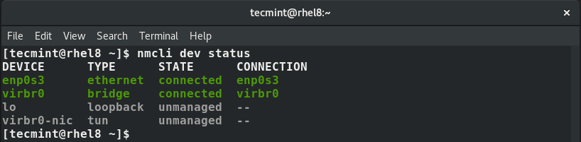
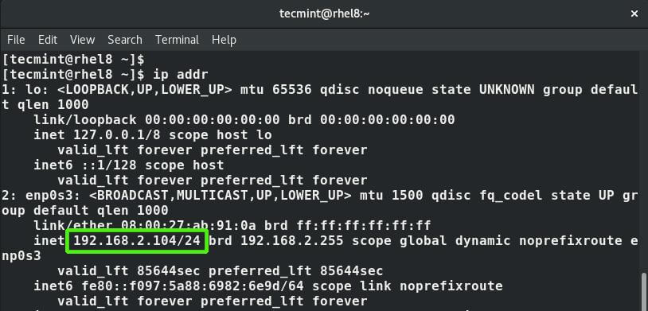
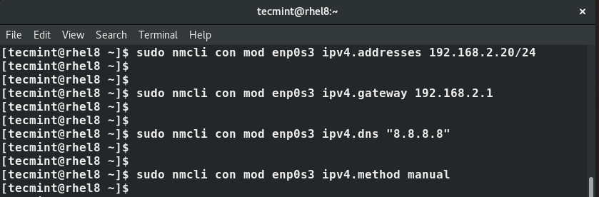
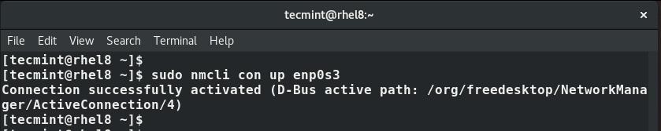
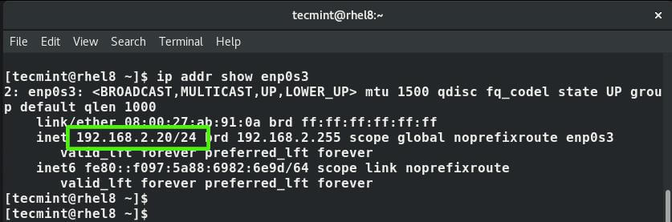
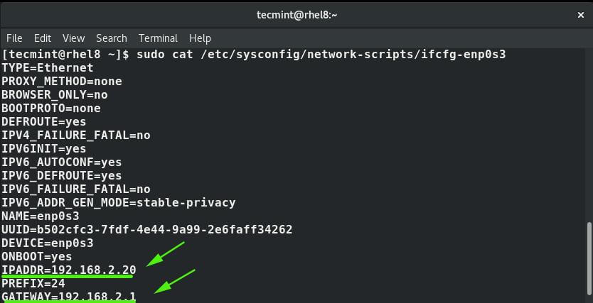

# Configure-Network-Connection-RHEL8-RHEL9
Configure Network Connection RHEL8 RHEL9

To display all the active network interfaces on your Linux system execute the command.
```bash
$ nmcli connection show
OR
$ nmcli con show
```

Note that con is the truncated form of connection and you will still end up with the same result as shown.


Also, you can run the command below to display both active and inactive interfaces.
```bash
$ nmcli dev status
```



Set Static IP Address Using nmcli Tool
Using nmcli tool, you can modify a network interface to use a static IP address. In this example, we will modify the network interface enps03 to use a static IP.

But first, let’s check the IP address using IP command.

```bash
ip addr
```


The current IP address is 192.168.2.104 with a CIDR of /24. We are going to configure a static IP with the following values:

```bash
IP address:		 192.168.2.20/24
Default gateway:	 192.168.2.1
Preferred DNS:		  8.8.8.8
IP addressing 		  static
```
First, run the command below to set up the IP address.

```bash
$ nmcli con mod enps03 ipv4.addresses 192.168.2.20/24
```
Next, configure the default gateway as shown:
```bash
$ nmcli con mod enps03 ipv4.gateway 192.168.2.1
```
Then set up the DNS server:
```bash
$ nmcli con mod enps03 ipv4.dns “8.8.8.8”
```
Next , change the addressing from DHCP to static.
```bash
$ nmcli con mod enps03 ipv4.method manual
```



To save the changes, run the command
```bash
nmcli con up enps03
```



The changes will be written to /etc/sysconfig/network-scripts/ifcfg-enps03 file.

```bash
ip addr enps03
```


Additionally, you can view the /etc/sysconfig/network-scripts/ifcfg-enps03 file using cat command.

```bash
$ cat /etc/sysconfig/network-scripts/ifcfg-enps03
```


And this concludes this guide on configuring network connection using ‘nmcli’ command-line tool on Linux.
