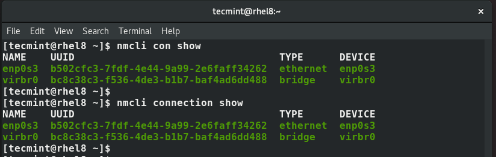

# Configure-Network-Connection-RHEL8-RHEL9
Configure Network Connection RHEL8 RHEL9

To display all the active network interfaces on your Linux system execute the command.
```bash
$ nmcli connection show
OR
$ nmcli con show
```

Note that con is the truncated form of connection and you will still end up with the same result as shown.


